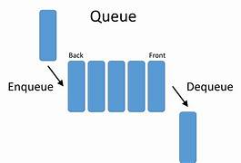

# What Are Queues, Anyways?


When you're in a line to check out at a grocery store, you enter at the end of the line. When the person at the front of the line is ready to check out, they leave the line, and the person behind them waits their turn. You may also notice someone stand behind you, as they have also entered the back of the line, and you are now closer to the front of the line, ready to check out. 

This is a real life application of a queue. We would call this a "First in, first out" sort of principle, where the person who had been there longer than the people in the queue is the one who will leave the queue first. 

## Queues in Python

When we want to make a queued data structure, we're essentially implementing this principle. You would put a piece of data at the end of a called list, then the next, and so on and so forth. Then, when you want to extract data from a list, you would get the first piece of data that was put in a list. 



To start, we would establish a queue within a piece of code:

```
queue = list()
```

We would then "enqueue," an item, or add `.append()` to the end of the newly established `queue` variable.

```
queue = list()

queue.append(23)
queue.append(4)
queue.append(8)

print(queue) # Expected: [23, 4, 8]
```

Interestingly, you can also "dequeue" an element within Python lists. Similar to if the person behind you in line walked out of the line to go grab something else. 

To "dequeue," an item from a list, we would simply just type `.pop()` after our established queue:

```
queue = list()

queue.append(23)
queue.append(4)
queue.append(8)

print(queue) # Expected: [23, 4, 8]

queue.pop()

print(queue) # Expected: [23, 4]
```

Notice how it took off the 8 at the end of the list? This is a simple way to simply remove an ending element. 

Now, what if you wanted to remove 23, or 4? Well guess what? That's possible too! All you have to do is put the element number within the parenthesis of the `.pop()` function!

(REMEMBER! List elements start with 0, not 1. If you wanted to remove 23, you'd need to write `queue.pop(0)`. `queue.pop(1)` would remove 4.)

```
queue = list()

queue.append(23)
queue.append(4)
queue.append(8)
queue.append(75)
queue.append(36)
queue.append(55)

print(queue) # Expected: [23, 4, 8, 75, 36, 55]

queue.pop(3)
queue.pop(0)

print(queue) # Expected: [4, 8, 36, 55]
```