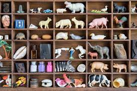

# All About Sets
Sets are a bit different from queues or stacks. For example, stacks have a first in, last out principle, and queues have a first in, first out principle. In sets, however, order doesn't matter at all. Putting data anywhere inside of a set really won't have any effect on whether or not you're able to "pop" or "append" an item within a set.

Another key difference is that sets don't allow any duplicates within the item list. The big O notation within a set is usually O(1) when you impliment a technique known as __hashing.__ Hashing allows the ability to add, remove, and test to see if an item is inside of a set, so it's very useful when we work with these sort of data structures. 



I like to think of sets as a collection of objects, like unique knick-knacks you bought as souveniers from places you've travelled, or baseball cards you've collected over the years. It's like a collection of unique items that you're able to place and take off of a shelf. 

When using sets, it'll usually have a Big-O notation of O(1), since you'll be able to pick and choose which elements you want to read within a set. 

## Examples.

You can declare a set by establishing the variable, then adding items insed curly braces, separated by commas.

To add elements, you would use `.add()`, and to delete elements, you would use `.remove()`

```python 

# Declaring a set
set = {"sprite", "gatorade", "apple juice", "water"}

print(set)

# Adding to a set
set.add("coca cola")

print(set)

# Removing from a set
set.remove("sprite")

print(set)

```

You can also combine two sets together by using `.union()`, or the `|` symbol. 

```python 
# Union

set_1 = {"Puppies", "Wolves", "Coyotes"}
set_2 = {"Kittens", "Mountain Lions", "Lynx"}

# These print the exact same things
print(set_1.union(set_2))
print(set_1 | set_2)
```

Finally, you can see the differences and similarities between the two sets by using `.difference()`, or adding `-` between the two sets.

* Note: Order matters here. 

```python 

set_3 = {"Carrot", "Tomato", "Spinach", "Celery"}
set_4 = {"Spinach", "Kale", "Carrot", "Pepper"}

# These print the exact same things
print(set_3.difference(set_4))
print(set_3 - set_4)
# Expected: Celery, Tomato

# If you were to reverse the order, you would get the results minus the other list
print(set_4.difference(set_3))
print(set_4 - set_3)
# Expected: Pepper, Kale
```
# Problem

Your cousin has been collecting different types of glass animals, and has asked you to organized them separately from sea creatures and land creatures. You've done this, but you made some mistakes along the way, and you accidentally organized some of the land animals into the sea creature list, and vice versa. 

Write a sort of filter that'll single out some of the animals that aren't in their right place. Use this [code](glass_animals.py) to get started.

If you get really stuck, look at the [solution](glass_animals_solution.py) here!