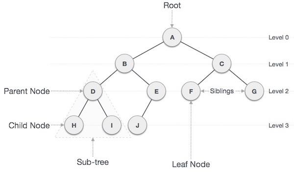

# Building Trees

When we think of trees, we think of this biological structure with branches jutting out of the main root. There's sort of a heirarchy when we think of tree branches. There's the trunk, which is the root that connections to the ground, then there are the branches that jut out of the trunk, and then those branches may either produce leaves, or create more branches, which those branches will have the same possibility. 

Trees are easy to understand, mostly because they're right there in front of us, and we're able to see it. However, trees as a data structure, are a bit trickier to grasp, possibly due to the abstractness of it all. 

Trees in the data structure world have *nodes,* where the data is stored. These nodes are connected by *pointers.* These nodes can connect to other nodes inside the tree, hence the name of this data structure.

A *parent node* is a node that's connected to a *child node*, and is higher up on the heirarchy of the tree, while a child node is lower on the heirarchy. 

The *root* is the first parent inside of the tree, or rather, the starting node. A *leaf* is a node that doesn't have any children. 

Finally, if we want to define a *subtree,* we would find all of the child nodes associated with one parent node. 

## The Different Types of Trees

There are three types of trees in the data structure world:

* Binary Tree - These trees only have two children per node

* Binary Search Tree - These trees organize values depending on if they're less or more than the root. If the value is more than the root, it's sorted to the right. If it's less, it's sorted to the left

* Balanced Search Tree (BST)- This is like the Binary Search Tree, but it instead aims to be balanced on both sides, rather than having one side weigh more than the other. These are usually ideal. 

As you may guess, there's also a bit of a heirarchy here as well. balanced search trees ARE binary search trees, and binary search trees are binary trees. 

## Accessing Binary Search Trees

